# MCP Client

Modern AI-powered product management system with natural language interface. Built with TypeScript, Express, and the Model Context Protocol (MCP).

## 🚀 Quick Start

**To access the chatbot:**
1. Clone this repository
2. Run `npm install && npm run build && npm start`
3. Open `http://localhost:3001` in your browser
4. Start chatting: "Show all products" or "Find MacBook products"

**Live Demo**: Currently runs locally - see [Deployment](#deployment) section for hosting options.

## About

This project demonstrates a complete AI-powered product management system that allows users to interact with a product database using natural language commands. Users can search, create, update, and manage products through conversational queries like "Find all MacBook products" or "Update the price of all iPhones to 999".

## Key Features

- **Natural Language Processing**: Convert user commands to database operations
- **Smart Product Search**: Find products by name, category, or segment with intelligent filtering
- **Bulk Operations**: Update multiple products at once with pattern matching
- **Modern UI**: Responsive interface with gradients, animations, and command history
- **Duplicate Management**: Detect and clean up duplicate products automatically

## Architecture

```mermaid
graph TB
    subgraph "Client Layer"
        UI["🖥️ Frontend UI<br/>📱 Modern Web Interface<br/>💬 Natural Language Chat<br/>📊 Real-time Display<br/>🏷️ Interactive Badges"]
    end
    
    subgraph "BFF Layer - Node.js Express Server"
        BFF["🚀 Express BFF Server<br/>📍 Port 3001"]
        Router["🛣️ Route Handler<br/>(routes.ts)<br/>📝 /api/command<br/>📊 /api/status"]
        LLMClient["🤖 LLM Client<br/>(llmClient.ts)<br/>💭 Command Processing<br/>🔄 Tool Call Generation"]
        MCPClient["🔌 MCP Client<br/>(mcpClient.ts)<br/>🌐 Remote Server Comm<br/>🔐 GCP Auth Tokens"]
        Cache["💾 Schema Cache<br/>(mcpSchemaCache.ts)<br/>⚡ Tool Definitions<br/>🔄 Auto-refresh"]
    end
    
    subgraph "AI Layer"
        Ollama["🧠 Ollama LLM<br/>🏠 Local Instance<br/>📝 llama3.1:8b<br/>⚡ Fast Processing"]
    end
    
    subgraph "Remote Services - Google Cloud"
        MCP["☁️ MCP Server<br/>🌍 Cloud Run Service<br/>🔗 JSON-RPC Protocol<br/>🛡️ Identity Token Auth"]
        DB["📦 Product Database<br/>📊 CRUD Operations<br/>🔍 Search & Filter<br/>📈 Analytics"]
    end
    
    %% User interactions
    UI -->|"Natural Language Command"| Router
    Router -->|"Parse & Route Request"| LLMClient
    
    %% LLM processing
    LLMClient -->|"Process Command"| Ollama
    Ollama -->|"Generate Tool Call"| LLMClient
    
    %% MCP communication  
    LLMClient -->|"Execute Tool Call"| MCPClient
    MCPClient -->|"JSON-RPC + Auth"| MCP
    MCP -->|"Database Query"| DB
    DB -->|"Product Data"| MCP
    MCP -->|"JSON Response"| MCPClient
    
    %% Response flow
    MCPClient -->|"Structured Data"| LLMClient
    LLMClient -->|"Format Response"| Router
    Router -->|"JSON Response"| UI
    
    %% Schema management
    Cache -->|"Cached Schemas"| LLMClient
    MCPClient -->|"Schema Updates"| Cache
    
    %% Styling
    classDef frontend fill:#e1f5fe,stroke:#0277bd,stroke-width:2px
    classDef bff fill:#f3e5f5,stroke:#7b1fa2,stroke-width:2px
    classDef ai fill:#e8f5e8,stroke:#388e3c,stroke-width:2px
    classDef cloud fill:#fff3e0,stroke:#f57c00,stroke-width:2px
    
    class UI frontend
    class BFF,Router,LLMClient,MCPClient,Cache bff
    class Ollama ai
    class MCP,DB cloud
```

<details>
<summary><strong>System Architecture Diagram</strong> - Click to view comprehensive architecture</summary>



**🔄 Data Flow Steps:**
1. **User Input** → Frontend UI receives natural language command
2. **Route Processing** → Express server parses and routes the request  
3. **LLM Analysis** → Ollama processes command with MCP schema context
4. **Tool Generation** → LLM generates appropriate MCP tool calls
5. **Remote Execution** → MCP Client executes tools on Cloud Run server
6. **Database Operations** → MCP Server performs CRUD operations
7. **Response Assembly** → Data flows back through the stack
8. **UI Display** → Frontend renders formatted results

**🏗️ Architecture Highlights:**

- **🎨 Modern UI Layer**: Interactive web interface with natural language processing
- **🔄 Smart BFF (Backend-for-Frontend)**: Express.js server with intelligent request routing
- **🤖 AI-Powered Processing**: Local Ollama LLM for fast command interpretation  
- **🌐 Cloud Integration**: Secure communication with Google Cloud Run MCP server
- **⚡ Performance Optimized**: Schema caching and connection pooling
- **🛡️ Enterprise Security**: GCP Identity Token authentication

</details>

**Key Components:**
- **Frontend**: Modern web interface with natural language chat, Real time response handling and product display, Interactive UI with clickable category/segment badges.
- **BFF (Backend-for-Frontend)**: Express.js server with LLM integration, Route handler, LLM Client convert commands to tool calls,MCP Client communicates with remote mcp server, Schema cache to cache mcp tool definitions. 
- **MCP Server**: Remote product management service with CRUD operations, hosted on Google Cloud Run, JSON RPC protocol , authentication with gcp identity tokens.

## 📊 Request Flow Examples

For detailed sequence diagrams showing how commands flow through the system, see [docs/FLOWS.md](docs/FLOWS.md):
- **"Show All Products"** - Complete query flow from user input to display
- **"Update Product Price"** - LLM-first approach with smart UUID resolution

## Local Setup

<details>
<summary><strong>Prerequisites & Installation</strong> - Node.js setup and project dependencies</summary>

### Prerequisites
- Node.js 18+
- Access to Ollama (local LLM) or configure cloud LLM

### Installation

1. **Clone the repository**
   ```bash
   git clone https://github.com/racho8/ravi-mcp-client.git
   cd ravi-mcp-client
   ```

2. **Install dependencies**
   ```bash
   npm install
   ```

3. **Build the project**
   ```bash
   npm run build
   ```

4. **Start the server**
   ```bash
   npm start
   ```

5. **Open the application**
   Navigate to `http://localhost:3001`

</details>

<details>
<summary><strong>Environment Variables (Optional)</strong> - Custom server configuration</summary>

```bash
export MCP_SERVER_URL='https://your-mcp-server.run.app/mcp'
export PORT=3001
```

</details>

## 🌐 Network Testing Setup

<details>
<summary><strong>For Team Members (Recommended) - Click to expand</strong></summary>

### **For Team Members (Recommended):**

If your team members want to checkout your branch and test it independently:

#### **Setup Steps:**

1. **Grant Cloud Run Invoker Role** (Project Owner does this once):
   ```bash
   # Replace with team member's service account email
   gcloud run services add-iam-policy-binding ravi-mcp-server \
     --region=europe-west3 \
     --member="serviceAccount:TEAM_MEMBER@YOUR_PROJECT.iam.gserviceaccount.com" \
     --role="roles/run.invoker"
   ```

2. **Team Member Setup:**
   ```bash
   # Clone and checkout your branch
   git clone https://github.com/racho8/ravi-mcp-client.git
   cd ravi-mcp-client
   git checkout main  # or your specific branch
   
   # Install dependencies
   npm install
   npm run build
   
   # Set up authentication (create service account key)
   gcloud iam service-accounts create mcp-testing
   gcloud projects add-iam-policy-binding YOUR_PROJECT_ID \
     --member="serviceAccount:mcp-testing@YOUR_PROJECT_ID.iam.gserviceaccount.com" \
     --role="roles/run.invoker"
   gcloud iam service-accounts keys create ~/mcp-key.json \
     --iam-account=mcp-testing@YOUR_PROJECT_ID.iam.gserviceaccount.com
   ```

3. **Environment Configuration:**
   ```bash
   # Set environment variables
   export GOOGLE_APPLICATION_CREDENTIALS="$HOME/mcp-key.json"
   export NODE_ENV=production
   export MCP_SERVER_URL="https://ravi-mcp-server-256110662801.europe-west3.run.app/mcp"
   export PORT=3001
   
   # Start the server
   npm start
   ```

4. **Test the setup:**
   ```bash
   curl -X POST http://localhost:3001/api/command \
     -H "Content-Type: application/json" \
   -d '{"command": "Show all products"}'
```

</details>

<details>
<summary><strong>For External Viewers (Demo Access) - Click to expand</strong></summary>

### **For External Viewers (Demo Access):**If you want to demo the application to external people without giving them access to your codebase:

#### **Host with Specific IP Access:**

1. **Start server with network binding:**
   ```bash
   # On your machine (find your IP first)
   ifconfig | grep "inet " | grep -v 127.0.0.1
   # Example output: inet 172.18.11.22 netmask 0xffffff00 broadcast 172.18.11.255
   
   # Start server (binds to all interfaces by default)
   export PORT=3001
   npm start
   
   # Server will be accessible at your specific IP
   echo "Application running at: http://172.18.11.22:3001"
   ```

2. **Share access with external viewers:**
   ```
   Demo URL: http://172.18.11.22:3001
   
   Try these commands:
   - "Show all products"
   - "Find all iPhone products" 
   - "Update iPhone18 price to 999"
   - "Count MacBook products"
   ```

3. **Network firewall considerations:**
   ```bash
   # macOS: Allow incoming connections on port 3001
   # System Preferences → Security & Privacy → Firewall → Options
   # Add Node.js application and allow incoming connections
   
   # Or use command line (if needed):
   sudo /usr/libexec/ApplicationFirewall/socketfilterfw --add /usr/local/bin/node
   sudo /usr/libexec/ApplicationFirewall/socketfilterfw --unblock /usr/local/bin/node
   ```

</details>

<details>
<summary><strong>Quick Testing Checklist</strong> - Verify setup completion</summary>

### **Quick Testing Checklist:**

✅ **For Team Members:**
- [ ] Service account created with Cloud Run Invoker role
- [ ] `GOOGLE_APPLICATION_CREDENTIALS` pointing to key file
- [ ] `NODE_ENV=production` set
- [ ] Application starts without auth errors
- [ ] Can successfully call `/api/command` endpoint

✅ **For External Viewers:**
- [ ] Your machine IP address determined (e.g., 172.18.11.22)
- [ ] Port 3001 accessible through firewall
- [ ] External users can access `http://YOUR_IP:3001`
- [ ] Demo commands work from external network

</details>

<details>
<summary><strong>Sample Commands for Testing - Click to expand</strong></summary>

### **Sample Commands for Testing:**
```bash
# Basic product listing
curl -X POST http://172.18.11.22:3001/api/command \
  -H "Content-Type: application/json" \
  -d '{"command": "Show all products"}'

# Product search  
curl -X POST http://172.18.11.22:3001/api/command \
  -H "Content-Type: application/json" \
  -d '{"command": "Find all iPhone products"}'

# Product update (LLM-first approach)
curl -X POST http://172.18.11.22:3001/api/command \
  -H "Content-Type: application/json" \
  -d '{"command": "Update iPhone18 price to 999"}'
```

</details>

<details>
<summary><strong>Security Notes</strong> - Important security considerations</summary>

### **Security Notes:**
- **Team Access**: Service account keys should be stored securely and rotated regularly
- **External Access**: Consider time-limited demos and firewall restrictions
- **Production**: Use proper load balancers and SSL certificates for public access

</details>

## Usage Examples

<details>
<summary><strong>Command Examples</strong> - Sample natural language commands</summary>

**Product Search:**
- "Show all products"
- "Find all MacBook products"
- "Show me products in Electronics category"

**Product Updates:**
- "Update the price of iPhone 15 to 899"
- "Update all iPhones to price 999"

**Counting & Analytics:**
- "How many products are there?"
- "Count MacBook products"

**Duplicate Management:**
- "Find duplicates"
- "Clean up duplicate products"

</details>


## Deployment

<details>
<summary><strong>Local Development Setup</strong> - Build and run locally</summary>

```bash
npm run build
npm start
```
Access at: `http://localhost:3001`

</details>

<details>
<summary><strong>Production Deployment</strong> - Environment variables and authentication</summary>

**Current Status**: This project is designed for local development with remote MCP server integration.

**To deploy your own instance:**

Set these environment variables in your hosting platform:
```
MCP_SERVER_URL=https://ravi-mcp-server-256110662801.europe-west3.run.app/mcp
PORT=3001
```

**Optional Authentication** (if your MCP server requires it):
```
MCP_AUTH_TOKEN=your-auth-token-here
```

**Authentication Notes:**
- **Local Development**: Uses `gcloud` CLI authentication automatically
- **Production**: Set `MCP_AUTH_TOKEN` environment variable if needed
- **Public Access**: If your MCP server allows unauthenticated access, no token needed

</details>

**Note**: The MCP server is already deployed and running on Google Cloud Run. You only need to deploy the frontend/BFF layer.

## Tech Stack

- **Frontend**: HTML, CSS, JavaScript (Modern UI)
- **Backend**: Node.js, Express.js, TypeScript
- **AI Integration**: Ollama LLM / Cloud LLM
- **Protocol**: Model Context Protocol (MCP)
- **Hosting**: Google Cloud Run (MCP Server)

## Contributing

1. Fork the repository
2. Create a feature branch
3. Make your changes
4. Submit a pull request

## License

MIT License - see LICENSE file for details.

---

Built with modern web technologies and AI-first design principles.