# MCP Client

Modern AI-powered product management system with natural language interface. Built with TypeScript, Express, and the Model Context Protocol (MCP).

## 🚀 Quick Start

**To access the chatbot:**
1. Clone this repository
2. Run `npm install && npm run build && npm start`
3. Open `http://localhost:3001` in your browser
4. Start chatting: "Show all products" or "Find MacBook products"

**Live Demo**: Currently runs locally - see [Deployment](#deployment) section for hosting options.

## About

This project demonstrates a complete AI-powered product management system that allows users to interact with a product database using natural language commands. Users can search, create, update, and manage products through conversational queries like "Find all MacBook products" or "Update the price of all iPhones to 999".

## Key Features

- **Natural Language Processing**: Convert user commands to database operations
- **Smart Product Search**: Find products by name, category, or segment with intelligent filtering
- **Bulk Operations**: Update multiple products at once with pattern matching
- **Modern UI**: Responsive interface with gradients, animations, and command history
- **Duplicate Management**: Detect and clean up duplicate products automatically

## Architecture

```
┌─────────────────┐    ┌──────────────────┐    ┌─────────────────┐
│   Frontend UI   │    │   Express BFF    │    │  MCP Server     │
│                 │    │                  │    │                 │
│ • Modern UI     │◄──►│ • LLM Client     │◄──►│ • Product CRUD  │
│ • Chat Interface│    │ • Route Handler  │    │ • Google Cloud  │
│ • Command History│   │ • Smart Parsing  │    │ • JSON-RPC      │
└─────────────────┘    └──────────────────┘    └─────────────────┘
```

**Components:**
- **Frontend**: Modern web interface with natural language chat, Real time response handling and product display, Interactive UI with clickable category/segment badges.
- **BFF (Backend-for-Frontend)**: Express.js server with LLM integration, Route handler, LLM Client convert commands to tool calls,MCP Client communicates with remote mcp server, Schema cache to cache mcp tool definitions. 
- **MCP Server**: Remote product management service with CRUD operations, hosted on Google Cloud Run, JSON RPC protocol , authentication with gcp identity tokens.

## 📊 Sample Flow: "Show All Products"

The following sequence diagram illustrates how the system processes a natural language command like "show all products":


### Flow Breakdown

**1. User Input (Frontend)**
- User types natural language command in chat interface
- JavaScript captures input and sends POST request to BFF

**2. Intent Recognition (LLM)**
- Dynamically fetches MCP tool schemas for up-to-date prompting
- Builds comprehensive prompt with 200+ lines of tool definitions
- Ollama LLM converts natural language to structured tool call

**3. Authentication & MCP Call**
- Automatically handles GCP authentication via gcloud CLI
- Builds JSON-RPC payload following MCP protocol standards
- Sends authenticated request to remote MCP server

**4. Data Processing**
- MCP server executes database operations
- Returns structured product data
- BFF applies intelligent post-processing (filtering, grouping, counting)

**5. Response Formatting**
- Frontend renders products as interactive cards
- Adds clickable category/segment badges for filtering
- Displays with animations and modern UI elements

### Key Architecture Benefits

- **Separation of Concerns**: Each layer has distinct responsibilities
- **Smart Caching**: Tool schemas cached for performance
- **Flexible Authentication**: Works locally and in production
- **Intelligent Processing**: Post-processing handles complex queries
- **Modern UX**: Real-time, interactive product displays

## 🔄 Sample Flow: "Update iPhone18 price to 666"

The following sequence diagram illustrates how the system processes an update command using the **LLM-first approach**:

```mermaid
sequenceDiagram
    participant User
    participant Frontend as Frontend UI<br/>(index.html)
    participant BFF as Express BFF<br/>(routes.ts)
    participant LLM as LLM Client<br/>(llmClient.ts)
    participant Ollama as Ollama LLM<br/>(Local)
    participant MCP as MCP Client<br/>(mcpClient.ts)
    participant GCP as GCP Auth
    participant Server as MCP Server<br/>(Google Cloud)
    participant DB as Product Database

    User->>Frontend: Types "Update iPhone18 price to 666"
    Frontend->>BFF: POST /api/command<br/>{"command": "Update iPhone18 price to 666"}
    
    Note over BFF: processNaturalLanguageCommand()
    BFF->>LLM: callLLM("Update iPhone18 price to 666")
    
    Note over LLM: Fetch cached MCP tool schemas
    LLM->>LLM: Build dynamic prompt with update_product tool definition
    
    Note over LLM: LLM-first natural language parsing
    LLM->>Ollama: POST /api/generate<br/>{"model": "llama3", "prompt": "...analyze and return tool call"}
    Ollama-->>LLM: {"tool": "update_product",<br/>"parameters": {"id": "iPhone18", "price": 666}}
    LLM-->>BFF: Tool invocation result
    
    Note over BFF: Handle update commands flow
    BFF->>BFF: Detect llmResult.tool === 'update_product'
    
    Note over BFF: Initial attempt (will fail for product names)
    BFF->>MCP: callMCP(update_product, {id: "iPhone18", price: 666})
    
    Note over MCP: Authentication & JSON-RPC call
    MCP->>GCP: execSync('gcloud auth print-identity-token')
    GCP-->>MCP: Bearer token
    MCP->>Server: POST /mcp<br/>{"method": "tools/call", "params": {<br/>"name": "update_product", "arguments": {"id": "iPhone18", "price": 666}}}
    
    Note over Server: UUID validation fails
    Server->>DB: No product found with ID "iPhone18"
    Server-->>MCP: {"result": {"response": "datastore: no such entity"}}
    MCP-->>BFF: Error response
    
    Note over BFF: Smart UUID resolution flow
    BFF->>BFF: Detect update_product command needs resolution
    BFF->>MCP: callMCP(list_products, {}) - Get all products
    
    MCP->>Server: POST /mcp<br/>{"method": "tools/call", "params": {"name": "list_products"}}
    Server->>DB: SELECT * FROM products
    DB-->>Server: All product records
    Server-->>MCP: {"result": [{"id": "uuid1", "name": "iPhone18", "price": 399}, ...]}
    MCP-->>BFF: Complete product list
    
    Note over BFF: Product name matching
    BFF->>BFF: Find product where name.toLowerCase() === "iphone18"
    BFF->>BFF: matchingProduct = {id: "806403a6-...", name: "iPhone18", price: 399}
    
    Note over BFF: Execute update with resolved UUID
    BFF->>MCP: callMCP(update_product, {<br/>id: "806403a6-c2c1-439c-8d9f-7d254cbf9b1b",<br/>price: 666})
    
    MCP->>Server: POST /mcp<br/>{"method": "tools/call", "params": {<br/>"name": "update_product", "arguments": {<br/>"id": "806403a6-c2c1-439c-8d9f-7d254cbf9b1b", "price": 666}}}
    
    Server->>DB: UPDATE products SET price = 666<br/>WHERE id = '806403a6-...'
    DB-->>Server: Update successful
    Server-->>MCP: {"result": {"success": true, "updated": {...}}}
    MCP-->>BFF: Success response
    
    Note over BFF: Enhanced response formatting
    BFF->>BFF: Create enhanced response:<br/>{success: true, message: "Successfully updated 'iPhone18' price to 666",<br/>productName: "iPhone18", oldPrice: 399, newPrice: 666}
    
    BFF-->>Frontend: {"result": {"success": true, "message": "...", "updatedProduct": {...}}}
    
    Note over Frontend: Display success feedback
    Frontend->>Frontend: Show success message with<br/>old price → new price transition
    Frontend->>User: "✅ Successfully updated 'iPhone18' price<br/>from 399 to 666"
    
    Note over User,DB: Complete update flow: ~300-800ms
```



### Update Flow Breakdown

**1. LLM-First Natural Language Processing**
- User provides command in any natural format: "Update iPhone18 price to 666"
- LLM intelligently parses intent and extracts: `tool: "update_product"`, `parameters: {id: "iPhone18", price: 666}`
- **No regex patterns** - pure LLM intelligence for command understanding

**2. Smart UUID Resolution**
- Initial attempt fails because "iPhone18" is a product name, not a UUID
- System automatically fetches all products via `list_products`
- Performs intelligent name matching (case-insensitive, exact + partial)
- Resolves product name → UUID: "iPhone18" → "806403a6-c2c1-439c-8d9f-7d254cbf9b1b"

**3. Successful Update Execution**
- Calls `update_product` with resolved UUID and new price
- Database update executed with proper entity identification
- Returns enhanced response with old price, new price, and success confirmation

**4. Enhanced User Feedback**
- Shows clear before/after price comparison
- Confirms which product was updated by name
- Provides detailed success messaging

### LLM-First Approach Benefits

- **Natural Language Flexibility**: Works with "Update iPhone18 price to 666", "Update the price of iPhone18 to 666", "Set iPhone18 to $666"
- **No Regex Dependency**: Eliminates brittle pattern matching - LLM handles all command variations
- **Smart Error Recovery**: Automatic UUID resolution when product names are provided
- **Enhanced UX**: Detailed feedback with price transitions and product confirmations
- **Robust Matching**: Handles exact name matches, partial matches, and case-insensitive matching

## Local Setup

### Prerequisites
- Node.js 18+
- Access to Ollama (local LLM) or configure cloud LLM

### Installation

1. **Clone the repository**
   ```bash
   git clone https://github.com/racho8/ravi-mcp-client.git
   cd ravi-mcp-client
   ```

2. **Install dependencies**
   ```bash
   npm install
   ```

3. **Build the project**
   ```bash
   npm run build
   ```

4. **Start the server**
   ```bash
   npm start
   ```

5. **Open the application**
   Navigate to `http://localhost:3001`

### Environment Variables (Optional)
```bash
export MCP_SERVER_URL='https://your-mcp-server.run.app/mcp'
export PORT=3001
```

## Usage Examples

**Product Search:**
- "Show all products"
- "Find all MacBook products"
- "Show me products in Electronics category"

**Product Updates:**
- "Update the price of iPhone 15 to 899"
- "Update all iPhones to price 999"

**Counting & Analytics:**
- "How many products are there?"
- "Count MacBook products"

**Duplicate Management:**
- "Find duplicates"
- "Clean up duplicate products"


## Deployment

### Local Development
```bash
npm run build
npm start
```
Access at: `http://localhost:3001`

### Production Deployment

**Current Status**: This project is designed for local development with remote MCP server integration.

**To deploy your own instance:**

Set these environment variables in your hosting platform:
```
MCP_SERVER_URL=https://ravi-mcp-server-256110662801.europe-west3.run.app/mcp
PORT=3001
```

**Optional Authentication** (if your MCP server requires it):
```
MCP_AUTH_TOKEN=your-auth-token-here
```

**Authentication Notes:**
- **Local Development**: Uses `gcloud` CLI authentication automatically
- **Production**: Set `MCP_AUTH_TOKEN` environment variable if needed
- **Public Access**: If your MCP server allows unauthenticated access, no token needed

**Note**: The MCP server is already deployed and running on Google Cloud Run. You only need to deploy the frontend/BFF layer.

## Tech Stack

- **Frontend**: HTML, CSS, JavaScript (Modern UI)
- **Backend**: Node.js, Express.js, TypeScript
- **AI Integration**: Ollama LLM / Cloud LLM
- **Protocol**: Model Context Protocol (MCP)
- **Hosting**: Google Cloud Run (MCP Server)

## Contributing

1. Fork the repository
2. Create a feature branch
3. Make your changes
4. Submit a pull request

## License

MIT License - see LICENSE file for details.

---

Built with modern web technologies and AI-first design principles.